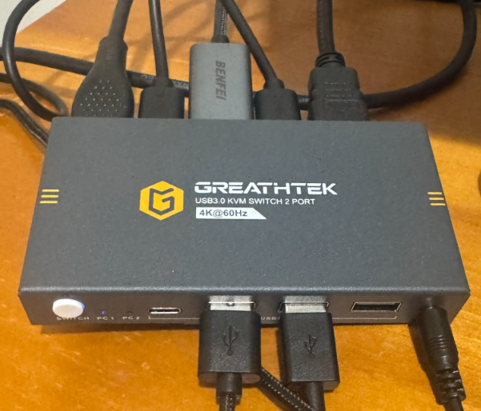

Working at home is nice. But having to switch between two computers is not...

One of my main issues on my WFH setup was having to switch between my work laptop and one of my home machines. Every time I clocked off work and wanted to go on my personal machine, I had to: 
1. Unplug my monitor's HDMI cable.
2. Unplug my USB Hub.
3. Move my work laptop and move my personal laptop in its place.
4. Plug in the HDMI and USB Hub.

This routine wasn't so bad until about a month in when it started getting really old so I finally caved and ordered a Keyboard, Video, Mouse (KVM) switch on Amazon from GREATHTEK. Th whole premise of a KVM switch is that it allows you to control multiple PCs using a single set of peripherals & monitors. The one I ordered supports a 2-computer and 1-monitor setup. 

After unboxing the manual specified the switch to have:
- a PC1 Port (USB 3.0 & HDMI in)
- a PC2 Port (USB 3.0 & HDMI in)
- HDMI out Port
- 3 USB 3.0 Ports
- 1 USB-C Port
- a CTRL port

## Hertz Hurts
I did encounter one problem when trying to set it up which was that my personal machine did not detect the display so I did what anyone else would've done which was to try to isolate the issue.

I first checked to make sure all of the HDMI cables were healthy by testing them on my monitor and my laptop. All of them worked so it was not the cables. Then, I swapped the cables for the PC1 and PC2 ports. Same issue. I then unplugged the HDMI cable and then tested to see if the USB switch worked when I swapped from my work machine to my personal machine. That part worked. 

I was beginning to think that I was sold a faulty machine but I was able to isolate the problem to the HDMI input and one thing I noticed was that my laptop screen was turning black whenever I plugged the HDMI cable in or swapped to it through the switch which meant that it was detecting the cable, just not displaying. I ended up asking GPT for a multitude of troubleshooting steps which did not work, until I remembered reading that the device supported 4K resolution @60hz. That's when I realized I was trying to run my display at 144hz on the switch and the second I changed it to 60hz, my monitor turned on. B r u h.

## MHO
Honestly I think for $33 this KVM switch works pretty well despite the fact that for some reason, the monitor only turns on when I have my external display set to "Extend Only" instead of the other settings like "Duplicate" on my laptop. I also thoroughly enjoyed the wired desktop controller that they included to let you use instead of the attached switch button on the switch. Do I recommend it? Yes, but if you wanted to utilize a higher refresh rate on your setups then I would opt for a more expensive alternative that actually supports higher refresh rates. 

